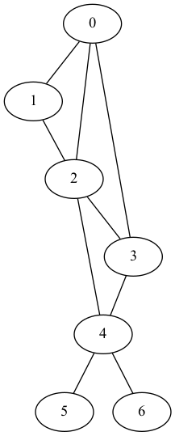

# Introduction 
Ce programme permet d'implémenter l'algorithme BFS et trouver le plus court chemin entre 2 sommets. 

# Utilisation
L'utilisateur saisit d'abord le nombre de noeuds et d'arêtes du graphe puis saisit un à un les couples de noeuds adjacents. 

Le programme affiche ensuite le graphe dans le format de GraphViz dans le terminal et dans un fichier graph.txt crée dans le répertoire courant, la matrice d'adjacence ainsi que le parcourt BFS. 

Il est possible de visualiser l'image vis.png du graphe générée par GraphViz avec la commande : `make vis` 

Il faut au préalable avoir installer GraphViz sur son ordinateur. 

## Graphe
 
